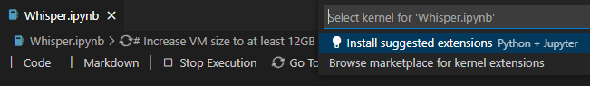
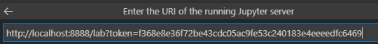

# ChromeOS_Whisper
Run Whisper AI Model on ChromeOS and on Windows WSL2

## Intro

[Whisper](https://github.com/openai/whisper) is an awesome AI model that does speech detection and transcription for multiple languages.

Change Log:

```
Initial commit of project
```

Testing:

* Using a Samsung ChromeBook 4, transcribing an English sentence from MP3 takes around 30 seconds.

* Use the `base` model on CB4 to avoid running out of memory when loading the model.

```
model = whisper.load_model("base")
```

* English language works.

* Chinese language transcribed `你好` (Hello).

* Running `whisper` with `WSL2` on `Windows` transcribes a sentence in `0.3 seconds`.

Process:

* Setup Chromebook in developer mode (this wipes all data) - https://chromeready.com/1186/how-to-enable-developer-mode-on-a-chromebook/

* Setup Linux Subsystem with 12GB of space. - https://support.google.com/chromebook/answer/9145439

* Install dependencies:

```
sudo apt-get update
sudo apt-get install curl
sudo apt-get install ffmpeg
```

* Install Anaconda - https://chromeready.com/5218/install-update-anaconda-chromebook/

* Install Anaconda through the `penguin` terminal so it shares the environment with VS Code.

```
mkdir ~/tmp && cd ~/tmp
curl -O https://repo.anaconda.com/archive/Anaconda3-2022.10-Linux-x86_64.sh
chmod +x ./Anaconda3-2022.10-Linux-x86_64.sh
./Anaconda3-2022.10-Linux-x86_64.sh
```

* Clean up the temp folder after install is complete.

```
cd ~
rm -r -f ~/tmp
```

* Update the symbolic links for Python.

```
sudo rm /usr/bin/python
sudo rm /usr/bin/pip
sudo rm /usr/bin/pip3
sudo rm /usr/bin/conda
sudo rm /usr/bin/jupyter
sudo ln -s ~/anaconda3/bin/python /usr/bin/python
sudo ln -s ~/anaconda3/bin/pip /usr/bin/pip
sudo ln -s ~/anaconda3/bin/pip3 /usr/bin/pip3
sudo ln -s ~/anaconda3/bin/conda /usr/bin/conda
sudo ln -s ~/anaconda3/bin/jupyter /usr/bin/jupyter
```

* Install [Visual Studio Code](https://code.visualstudio.com/download) - https://chromeunboxed.com/how-to-install-visual-studio-code-on-a-chromebook/

* Check out this repository to a place that Linux has access to like ~/Downloads/Whisper - https://www.techrepublic.com/article/how-to-share-files-with-linux-apps-on-chrome-os/

* Share the Downloads/Whisper folder with the Linux environment.

* Open the [Whisper Notebook](Whisper.ipynb) in VS Code

* Running the first cell in the notebook might prompt to install extensions for `Python + Jupiter`. Accept installing the extensions and restart `VS-Code` after the extension installation completes. This allows you to execute the code snippets in the notebook directly from `VS Code`.



* Running a notebook cell might prompt to `Connect to a Jupyter Server`.


* Record new audio clips with a microphone recorder tool like `Voice Recorder` which saves `WAV` and `MP3` files. (MP3 runs faster with Whisper). Recordings save to `Play Files\Recorders`.

## WSL2 on Windows

* Install WSL2 with Ubuntu 22.04 on Windows - https://apps.microsoft.com/store/detail/ubuntu/9PDXGNCFSCZV

* Note: You can find the WSL2 directory on Windows in `\\wsl$\Ubuntu-20.04\home`.

* Follow the steps from above and run in the Ubuntu terminal. You should install the dependencies including Anaconda with the same code above in the Ubuntu terminal.

* Get the code and open `VS Code`

```
mkdir ~/Public
cd ~/Public
git clone https://github.com/tgraupmann/ChromeOS_Whisper
cd ChromeOS_Whisper
code .
```

* Install the `jupyter` extension. You may have to use the extension browser and select `Install in WSL: Ubuntu: 20.X`.


* Install dependencies to run `jupyter` server.

```
pip3 install jupyter
pip3 install jupyterlab
pip3 install markupsafe==2.0.1
pip3 install traitlets==5.1.1
pip3 install pygments==2.4.1
sudo apt-get install jupyter-core
```

* Start the `jupyter` server in the `WSL2` terminal. Starting the lab logs an authorization url that can be used in the browser or `VS Code`.

```
jupyter lab
```

* The same link can be entered into `VS Code` to connect to the `jupyter server`.



* After connecting to the `jupyter server` select the `Whisper.ipynb` notebook and then `VS Code` can run the notebook cells.

* If you use the browser interface, use the `jupyter lab` to open the `Whisper.ipynb` notebook which should change the URL to something like - http://localhost:8888/lab/tree/Whisper.ipynb

* In my case I needed to upgrade the CUDA support in PyTorch.

```
conda install pytorch torchvision torchaudio cudatoolkit=11.3 -c pytorch
```

* Installing CUDA 11.3 support includes `sm_86` which is needed for `NVIDIA GeForce RTX 3070`.

```
python PrintCudaSupport.py
archList:  ['sm_37', 'sm_50', 'sm_60', 'sm_61', 'sm_70', 'sm_75', 'sm_80', 'sm_86', 'compute_37']
```

* `Notebook Whisper.ipynb is not trusted` okay...

```
jupyter trust Whisper.ipynb
```

* And restart the lab.

```
jupyter lab
```

## Translation

* `Test_Chinese.mp3` is an audio translation of the following English text to see how well the model translates from Mandarin to English. This is the original script.

<p>
OK, here we go. I'm going to read the script you gave me by using Mandarin Chinese. Okay go over to the title bar window, select the blue color. What time zone are you in? Are you on Windows? Are you familiar with the application? How many games do you have on steam? From the color picker select the color value. Use the hex code with a hash.
</p>

* Results with the `tiny` model.

<p>
Okay, here we go. I'm gonna read the script you gave me by using Manoring Chinese. Okay, we're now going to Windows, Zhuang Thai, Lan, Xuan Ze Lan. What are you doing in the studio? You're using Windows, do you want to do a new thing? You're using the same software. When in Steam what you get, you have some information. From for virtual machines to forc it's here withience. It's my package to choose your private choice.
</p>

* Results with the `base` model.

<p>
Okay, here we go. I'm gonna read the script you gave me by using Mandarin Chinese. Okay, now we're going to Wendels, the blue one. What are you actually doing? Are you using Wendels? You are using this to use the熟悉? How many games do you have on Steam? Since pargnol colored, select d for this from him.
</p>

* Results with the `small` model.

<p>
 OK, here we go. I'm going to read the script you gave me by using Manning Chinese. OK, now we go to Windows, select blue. What is your current time zone? Are you using Windows operating system? Are you familiar with this application process? How many games do you have on Steam? Select the color system from the color value. We enable since and add ser directory up.
 </p>

* Results with the `medium` model.

<p>
Ok, here we go. I'm gonna read the script you gave me by using Mandarin Chinese. Ok, let's go to Windows, and select blue. What is your location? Are you using Windows operating system? Are you familiar with this app? How many games do you have on Steam? Select the color value from the color selector, use the hex code and add the warning key.
</p>

* Results with the `large` model.

<p>
This model required too much GPU RAM for my PC to run.
</p>